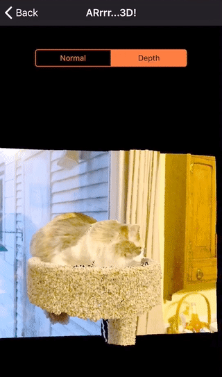

# ARrrr

This was my entry in the inaugural ACV internal hackathon. My goal was to use Augmented Reality, specifically ARKit, and the iPhone depth camera. With a focus on AR, the name ARrrr came naturally, as did the pirate theme. 

The app has these three functions:

1. Measure objects in the real world
2. Take a depth photo and render is as a 3D point cloud
3. Take a depth photo and replace pixels at or greater than a user-selected depth with a static image.

I didn't finish task 3 in time for the hackathon deadline. But the other two functions work.

**Note:** You have to take the depth photo with the phone held in landscape mode.

### Credits

* The point cloud renderer is from https://github.com/shu223/iOS-Depth-Sampler with some tweaks by me
* Icon font - https://icomoon.io/app
* Pirate graphic - From https://www.pngkey.com/png/detail/23-239564_pirate-png-high-quality-image-scribblenauts-pirate.png via a Google Images search. My apologies to the creator if it's not free for use in this way. Contact me and I'll remove it.

